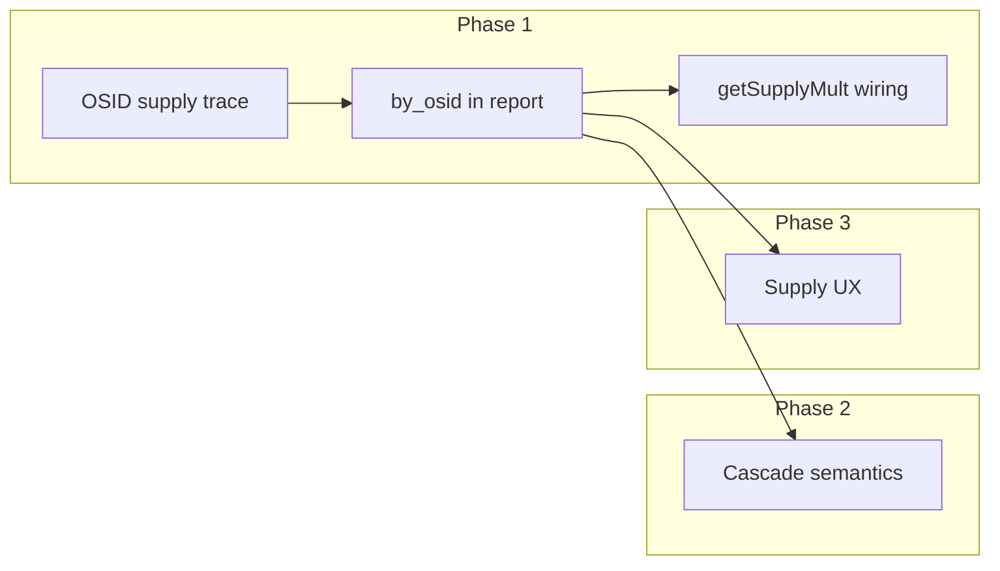

# Supply Design Implementation Plan

This plan implements [docs/30_planning/SUPPLY_DESIGN.md](SUPPLY_DESIGN.md) as agreed by the full Paradox team convene. It is **Orchestrator-endorsed**: phased delivery, **refactor-pass between each phase**, determinism required, no canon edits without Architect (and where noted, Game Designer) sign-off.

**Decision rule:** When a decision is needed during implementation (e.g. Option A vs B, same-turn vs next-turn cascade, recompute vs cache), **Architect makes the call** but **flags it for user review** (e.g. in a short "Decisions for review" list in the phase deliverable or in the ledger.

---

## Dependency and ordering

- **Phase A (Supply Reserves) — COMPLETE (2026-03-01):** Faction-level two-category reserves (general_supply + heavy_munitions [0..100]), maintenance drain, combat expenditure, effective supply state (reachability × reserves). Gated by `supply_reserves_enabled` scenario flag. See [SUPPLY_AMMO_SYSTEM_PLAN.md](SUPPLY_AMMO_SYSTEM_PLAN.md) and [20260301_SUPPLY_RESERVES_PHASE_A_IMPLEMENTATION.md](../40_reports/implemented/20260301_SUPPLY_RESERVES_PHASE_A_IMPLEMENTATION.md). Phase A is a **parallel track** to Phase 1; effective supply state in `getSupplyMult` combines Phase 1 OSID reachability with Phase A reserve levels.
- **Phase B+C (Siege + Replenishment + Enclave Hardening) — COMPLETE (2026-03-02):** Phase B adds escalating siege drain (per besieged OSID via `siege_turn_counters`), patron aid income, embargo reduction, facility combat damage. Phase C enhances enclave resilience with structured `EnclaveResilienceEntry` (isolation tracking, hardening defense bonus after 8+ turns, exhaustion reduction for RBiH). Pipeline step `update-siege-counters`. All gated by `supply_reserves_enabled`. See [20260302_SUPPLY_SYSTEM_PHASE_B_C_IMPLEMENTATION.md](../40_reports/implemented/20260302_SUPPLY_SYSTEM_PHASE_B_C_IMPLEMENTATION.md).
- **Phase 1** is the minimum viable slice: OSID supply state in combat (supply_mult from location) and report shape. Unblocks Phase 2 and 3. Phase A reserve integration via `getEffectiveSupplyState()` is already wired into `getSupplyMult`.
- **Phase 2** (cascade) and **Phase 3** (UX) can be sequenced by PM after Phase 1; Phase 3 does not depend on Phase 2.
- **Phases 4 and 5** (enclave resilience/hardening, bot supply awareness) are **in scope** (not optional) and depend on Phase 1 (and for Phase 4, Game Designer formula).
- **Refactor-pass** runs **between each phase**: after Phase 1, after Phase 2, after Phase 3, after Phase 4, and after Phase 5. Per [refactor-pass skill](.cursor/skills/refactor-pass/SKILL.md): review changes, remove dead code/paths, straighten logic, trim parameters, run build/tests; optional abstractions only if they clearly improve clarity.

---

## Phase 1: OSID supply trace + supply_mult in combat

**Goal:** When operational (OSID) data is present, supply state is derived per OSID and used for `supply_mult` in attack resolution and combat predictor; otherwise keep current `last_supplied_turn` fallback.

**Owners:** Gameplay Programmer (implementation); Technical Architect (report shape, pipeline contract); Systems Programmer (determinism).

### 1.1 OSID supply reachability and report extension

- **New or extended module:** Implement OSID-level supply trace when operational graph is available.
  - **Inputs:** `GameState`, OSID adjacency (from `loadOperationalEdges` + optional `operationalToCanonical`), control per OSID (from existing `getPoliticalControllerOSID` / control by OSID in [src/state/settlement_control.ts](src/state/settlement_control.ts)), faction `supply_sources` (map to OSIDs via canonical_to_operational where needed).
  - **Logic:** BFS from faction supply sources over **OSID graph** (only through faction-controlled OSIDs). Output: per-faction `reachable_osids`, `isolated_osids`, `edges_used` (OSID edge format).
  - **Determinism:** Sorted iteration (faction_id, then OSID localeCompare); no timestamps or RNG.
- **Report shape:** Extend [SupplyStateDerivationReport](src/state/supply_state_derivation.ts) (or add a parallel type) with optional **by_osid** per faction: `{ osid, state }[]` sorted by osid, with `adequate` / `strained` / `critical` derived from same rules as settlement (isolated → critical; reachable with brittle path → strained; else adequate). Reuse [deriveCorridors](src/state/supply_state_derivation.ts) pattern for OSID edges (bridge → brittle).
- **Controlled set for OSID path:** Use political control keyed by OSID (not `areasOfResponsibility`). Control is already available via `getPoliticalControllerOSID` and state `political_controllers`; when operational data is present, use OSID-keyed control to build controlled OSID set per faction.

### 1.2 Where to run OSID supply and attach to report

- **Option A (recommended):** Add a **Phase II–only** step **after** `zoc-computation` that:
  - Reads `getOperationalData(context)` (already populated by [zoc-computation](src/sim/turn_pipeline.ts) step).
  - Runs OSID supply reachability + derivation (by_osid) using OSID edges and reverse map.
  - Writes result into `context.report.supply_resolution.supply_state_by_osid` (or extends `supply_state` with optional `by_osid` per faction).
- **Option B:** Inside [supply-resolution](src/sim/turn_pipeline.ts), when `meta.phase === 'phase_ii'`, load operational data (and edges) and run OSID trace; merge by_osid into report. This duplicates operational load if zoc-computation already runs; prefer Option A unless a single "supply" step is required for clarity.
- **Pipeline order:** supply-resolution runs before Phase II steps; zoc-computation runs in Phase II. So Phase 1 adds one new step, e.g. `phase-ii-supply-osid`, after zoc-computation, that produces/attaches by_osid. If Option B is used, supply-resolution must accept async load of operational data in Phase II and attach by_osid there.

### 1.3 Wiring getSupplyMult to supply state at location_osid

- **attack_resolution_osid:** [getSupplyMult](src/sim/combat/attack_resolution_osid.ts) currently uses only `formation.ops.last_supplied_turn`. Change to:
  - Accept an optional **supply report** (with optional by_osid). Signature change: callers pass `supplyStateReport` (or context) so that inside the module a helper can resolve supply state at `formation.location_osid` when by_osid is present for the formation's faction.
  - When (1) OSID data is in use for the run and (2) report contains by_osid for the formation's faction and (3) `formation.location_osid` is set: lookup state at that OSID; map Adequate→1.0, Strained→0.7/0.8, Critical→0.4/0.5 (attack/defend).
  - Else: keep current fallback (last_supplied_turn ≤2 → 1.0; else 0.4 / 0.5).
- **combat_predictor:** Same logic: [getSupplyMult](src/sim/combat/combat_predictor.ts) must accept optional supply report and use formation.location_osid + by_osid when available; otherwise last_supplied_turn.
- **Pipeline:** When calling `resolveAttackOrdersOsid`, pass the supply report (with by_osid) from context—e.g. `context.report.supply_resolution?.supply_state` plus optional `context.report.supply_resolution?.supply_state_by_osid` or the extended field. So `resolveAttackOrdersOsid` signature gains an optional 5th parameter (supply report or by_osid lookup). Combat predictor is used by bot AI; ensure the same report (or a recomputed-by_osid view) is available where combat predictor is invoked (e.g. from bot layer with same context/report).

### 1.4 Tests and determinism

- **Unit tests:** (1) OSID supply reachability: given a small OSID graph and control/sources, assert reachable_osids and isolated_osids and by_osid state. (2) getSupplyMult: with mock report and formation.location_osid, assert correct multiplier; without report or without location_osid, assert fallback.
- **Determinism:** Same state + same operational data → same by_osid and same supply_mult. No timestamps or Math.random in new code. Sorted iteration everywhere (faction_id, osid, edge_id).

### 1.5 Canon and docs

- **Canon:** Optional Systems Manual §14.2 clarification: "When operational layer is authoritative, supply state may be defined per OSID; derivation and report shape per SUPPLY_DESIGN.md." **Architect sign-off** before merging canon change.
- **Docs:** Update [PIPELINE_ENTRYPOINTS.md](docs/20_engineering/PIPELINE_ENTRYPOINTS.md) with new step name; add implementation-note in Phase II Spec §8 if supply_mult source is clarified. Ledger entry for Phase 1 completion.

### 1.6 Refactor-pass (after Phase 1)

- **Refactor-pass** per refactor-pass skill: review Phase 1 changes; remove dead code/paths; straighten logic; trim excessive parameters; run `tsc --noEmit` and `vitest run`. Flag any optional abstractions only if they clearly improve clarity. Then proceed to Phase 2.

---

## Phase 2: Corridor collapse and cascade

**Goal:** Formalize cascade semantics: when a critical edge is lost (control flip), dependent regions transition Adequate→Strained→Critical with deterministic ordering; document or implement "cascade visible same turn vs next turn."

**Owners:** Gameplay Programmer (derivation logic); Systems Programmer (invariants, determinism).

### 2.1 Cascade rule and ordering

- **Rule:** Region R transitions to **Strained** if the only path from R to sources uses at least one brittle edge; R transitions to **Critical** if no path. "Dependent" = set of nodes that become isolated or strained when an edge is removed; propagation order: by faction_id asc, then by node id (sid or osid) asc.
- **Implementation:** Current [deriveSupplyState](src/state/supply_state_derivation.ts) and corridor derivation already recompute each turn from reachability. Cascade is implicit in "recompute after control flips": supply-resolution (and Phase II OSID step) runs once per turn; control flips occur in resolve-attack-orders. So cascade is **next-turn visible** unless we re-run supply after attacks in the same turn. Design doc allows either (a) re-run supply after control flips in same turn or (b) document next-turn visibility. **Recommend (b)** for Phase 2: document that cascade is visible at start of next turn; no second supply run in same turn. Option (a) can be a follow-up if product requests same-turn cascade.
- **Dependency threshold:** Engine Invariants §4: "junction loss alone must not collapse a corridor unless dependency thresholds are crossed." Implement: a single edge loss collapses only the regions that had **no alternative path** (i.e. that edge was critical for them). Bridge detection already marks edges as brittle; "cut" for untraversed edges. No change to junction-vs-bridge rule without Architect/Systems sign-off.

### 2.2 Tests and canon

- **Tests:** Deterministic: same control flip pattern → same by_settlement/by_osid state on next turn. Unit test: small graph, flip one control, re-run supply next "turn," assert expected strained/critical counts.
- **Canon:** Recommend Engine Invariants §4 addition: "Cascade: dependent regions transition Adequate→Strained→Critical only when dependency threshold is crossed. Propagation order is deterministic (e.g. by faction, then by node id)." **Architect sign-off.**

### 2.3 Refactor-pass (after Phase 2)

- **Refactor-pass:** Review Phase 2 changes; remove dead code; straighten logic; run build/tests. Then proceed to Phase 3.

---

## Phase 3: Minimum viable supply UX

**Goal:** Single view: corridor state (Open/Brittle/Cut) and isolation summary (counts per faction). Optional map layer for "threatened corridors." No per-settlement micromanagement.

**Owners:** Architect (UX spec); UI/UX Developer or Graphics (implementation).

### 3.1 Adapter and IPC

- **Adapter:** Expose corridor report and supply state summary from existing report. [GameStateAdapter](src/ui/map/data/GameStateAdapter.ts) (or warroom data path) should expose: per-faction `adequate_count`, `strained_count`, `critical_count` (already in [SupplyStateDerivationReport](src/state/supply_state_derivation.ts)); and corridor summary (e.g. per-faction counts of open/brittle/cut, or list of brittle/cut edge ids for overlay). Data is in `context.report.supply_resolution` during run; for UI, report may need to be stored on state or provided via IPC.
- **IPC:** [query-supply-paths](src/desktop/desktop_sim.ts) exists; extend or add **query-corridor-summary** (or extend query-supply-paths return) to include corridor state counts and isolation counts so the UI can render one panel without full by_settlement/by_osid.
- **Source of report in desktop:** During advance turn, report lives in context; for "current state" query, supply report may need to be recomputed from state (deterministic) when the UI asks for it, or persisted in a shallow "last supply report" cache on state/session. **Decision:** Architect chooses (recompute on query vs cache); **flag for user review** in phase deliverable or ledger.

### 3.2 UI components

- **Panel or section:** One place (e.g. FactionOverviewPanel or a dedicated "Supply" section) showing per-faction: corridor state summary (e.g. "X open, Y brittle, Z cut") and isolation summary ("Adequate: N, Strained: M, Critical: K"). Replace or augment current "Supply (days)" single number per [STRATEGIC_DESIGN_COUNCIL_AUDIT](docs/40_reports/audit/STRATEGIC_DESIGN_COUNCIL_AUDIT_2026_02_15.md).
- **Optional map layer:** Toggle to show "threatened corridors" (brittle/cut edges) on tactical or 3D map; reuse or extend existing overlay pipeline. Lower priority than the panel.

### 3.3 Canon and docs

- No canon change for UI. Update [TACTICAL_MAP_SYSTEM](docs/20_engineering/TACTICAL_MAP_SYSTEM.md) or [DESKTOP_GUI_IPC_CONTRACT](docs/20_engineering/DESKTOP_GUI_IPC_CONTRACT.md) if new IPC or adapter contract is added. Ledger entry.

### 3.4 Refactor-pass (after Phase 3)

- **Refactor-pass:** Review Phase 3 changes (adapter, IPC, UI); remove dead code; straighten logic; run build/tests. Then proceed to Phase 4.

---

## Phase 4: Enclave resilience and hardening

**Goal:** Enclave resilience curve (bounded growth when isolated, reduces exhaustion or improves cohesion recovery in enclaves); hardening (defense/cohesion bonus after N turns strained/critical in enclave). Bounded and deterministic. **In scope** (not optional).

**Owners:** Game Designer (formula, caps); Gameplay Programmer (implementation). **Game Designer + Architect sign-off** for canon.

### 4.1 Design

- **Enclave detection:** Use existing or extended enclave list (e.g. Srebrenica, Žepa, Goražde, Bihać) or derive from geography/control; design doc leaves formula to Game Designer.
- **Resilience:** Per-enclave (or per-OSID in enclave) value that grows when isolated (bounded cap); effect: reduce exhaustion accumulation or improve cohesion recovery in that enclave only.
- **Hardening:** After N turns strained/critical in enclave, small defense or cohesion-recovery bonus; bounded.
- **State:** Optional `enclave_resilience` (or derived each turn and exposed in report only). No new persisted state required if derived each turn.

### 4.2 Implementation and canon

- Derivation step or report extension; exhaustion/cohesion consumers (Phase II pressure, formation lifecycle) read resilience/hardening when in enclave. Deterministic: sorted iteration, no RNG.
- Canon: recommend §14.4 or §16 addition for enclave resilience/hardening per SUPPLY_DESIGN.md. **Game Designer + Architect sign-off.**

### 4.3 Refactor-pass (after Phase 4)

- **Refactor-pass:** Review Phase 4 changes; remove dead code; straighten logic; run build/tests. Then proceed to Phase 5.

---

## Phase 5: Bot supply awareness

**Goal:** Bot uses supply_mult and supply state in target scoring and defense priority; BFS supply trace in OSID graph for "supply connectivity" in shared intelligence ([BOT_AI_DESIGN_SPEC](design/BOT_AI_DESIGN_SPEC.md) Phase 3). **In scope** (not optional).

**Owners:** Gameplay Programmer (with bot owner).

### 5.1 Integration

- **Data:** Bot reads same supply report (with by_osid) and formation `location_osid`; no new state.
- **Scoring:** In [bot_brigade_ai](src/sim/combat/) (or equivalent), add supply state at formation location and at target OSID to target scoring (corridor_open, supply_isolation already in spec; add supply_mult prediction). Combat predictor already gets supply_mult once wired in Phase 1; bot can use same predictor.
- **Supply connectivity:** Precompute BFS from faction "HQ" (e.g. capital or first supply source) through friendly OSIDs; expose in shared intelligence for chokepoint/corridor defense. Can be derived from same OSID supply reachability used in Phase 1.

### 5.2 Refactor-pass (after Phase 5)

- **Refactor-pass:** Review Phase 5 changes (bot scoring, supply connectivity); remove dead code; straighten logic; run build/tests. Final verification and ledger entry.

---

## Sign-off and sequencing

- **Architect sign-off:** Any canon changes (Phases 1–2, Phase 4) require Architect (product architecture) sign-off before adoption. Phase 4 also requires Game Designer sign-off.
- **Architect decisions for user review:** When a decision is made by Architect during implementation (e.g. Option A vs B for OSID step placement, same-turn vs next-turn cascade, recompute vs cache for supply report in UI), **flag it for user review** (e.g. "Decisions for review" list in phase summary or PROJECT_LEDGER entry).
- **PM sequencing:** After Phase 1 is complete and verified, PM sequences Phase 2 vs Phase 3, then Phase 4, then Phase 5. **Refactor-pass runs after each phase** before starting the next.
- **Verification:** Each phase: `tsc --noEmit`, `vitest run` (and relevant unit tests), and optionally one scenario run (e.g. apr1992_definitive_52w 20w) to confirm no regressions. Phase 1 may change combat outcomes when OSID supply is present; baseline strategy (TEST_BASELINE_STRATEGY.md) applies—sign-off before baseline refresh.

---

## File and role summary

| Phase | Key files                                                                                                                                                                                                                                                                                                                                               | Roles                             |
| ----- | ------------------------------------------------------------------------------------------------------------------------------------------------------------------------------------------------------------------------------------------------------------------------------------------------------------------------------------------------------- | --------------------------------- |
| 1     | [supply_reachability.ts](src/state/supply_reachability.ts) (or new supply_reachability_osid.ts), [supply_state_derivation.ts](src/state/supply_state_derivation.ts), [turn_pipeline.ts](src/sim/turn_pipeline.ts), [attack_resolution_osid.ts](src/sim/combat/attack_resolution_osid.ts), [combat_predictor.ts](src/sim/combat/combat_predictor.ts) | Gameplay, Tech Architect, Systems |
| 2     | [supply_state_derivation.ts](src/state/supply_state_derivation.ts), Engine_Invariants §4                                                                                                                                                                                                                                                                | Gameplay, Systems                 |
| 3     | Adapter, [desktop_sim.ts](src/desktop/desktop_sim.ts), FactionOverviewPanel or supply panel, optional map overlay                                                                                                                                                                                                                                       | Architect, UI/UX or Graphics      |
| 4     | New derivation/report, exhaustion/cohesion consumers, enclave detection                                                                                                                                                                                                                                                                                 | Game Designer, Gameplay           |
| 5     | Bot brigade AI, combat predictor integration                                                                                                                                                                                                                                                                                                            | Gameplay                          |

---

## References

- [SUPPLY_DESIGN.md](SUPPLY_DESIGN.md) §2 (current state), §3–§9 (target design and phases)
- [ORCHESTRATOR_SUPPLY_FULL_TEAM_CONVENE_2026_02_24.md](docs/40_reports/convenes/ORCHESTRATOR_SUPPLY_FULL_TEAM_CONVENE_2026_02_24.md) §7 (team input, single priority)
- [Engine_Invariants_v0_5_0.md](docs/10_canon/Engine_Invariants_v0_5_0.md) §4
- [Systems_Manual_v0_5_0.md](docs/10_canon/Systems_Manual_v0_5_0.md) §14
- [Phase_II_Specification_v0_5_0.md](docs/10_canon/Phase_II_Specification_v0_5_0.md) §8
