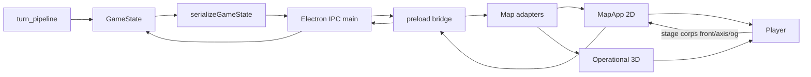

# Orchestrator Convene: GUI and Map Rework Audit for Frontline Mechanics

**Date:** 2026-02-21  
**Scope:** Full GUI/map redesign audit for frontline mechanics after 3D map integration and front-assignment phases.  
**Goal:** Identify what to keep/change/remove, close frontline visibility gaps, and map implementation handoffs across the Paradox team.

---

## 1) Big-Picture Decision

- **Single priority:** Make frontline mechanics playable and legible in the live GUI first.
- **Definition of done for this priority:**
  - Front lines are visible on 2D and 3D from canonical state when available.
  - Corps-level assignment is possible from GUI (front + axis + OG subfront path).
  - Contracts and docs reflect actual channels and behavior.

---

## 2) System Interaction Map (Engine -> GUI loop)

---

## 3) GUI Audit Table (Keep / Change / Remove)

| Surface | Element | Status | Action | Owner |
|---|---|---|---|---|
| Tactical map (2D) | Front lines layer toggle | Keep | Keep toggle; draw from canonical `front_edges` when present, fallback when absent | Gameplay + UI |
| Tactical map (2D) | `drawFrontLines()` defended-only behavior | Change | Canonical mode now renders strategic front even when no local brigade defender | Gameplay |
| Tactical map (2D) | Corps panel actions | Change | Add `Stage Front`, `Stage Axis`, `Stage OG` actions using existing IPC | UI/UX + Gameplay |
| Tactical map (2D) | Brigade panel order flows | Keep | Keep existing attack/move/reposition; no regression | UI/UX |
| Tactical map (2D) | Main menu overlay | Keep (already fixed) | Keep recent fix: no forced open when desktop state exists | UI |
| Operational 3D | Frontline mesh | Change | Use canonical edges when available; robust fallback when canonical edges are missing/unmatched | Graphics |
| Operational 3D | Map modes F1..F4 | Keep | Keep, align overlays with new frontline semantics | Graphics + UI |
| Operational 3D | Corps front editing controls | Change (future parity) | Track for parity after 2D corps panel path is stable | UI/UX + Graphics |
| Staff map | Frontline rendering | Keep/Change | Keep surface; align source-of-truth with canonical front data path | Graphics |
| Warroom | Tactical entrypoint | Keep | Keep embedded tactical map; add front-command discoverability later if needed | UI/UX |
| War Planning Map (Phase 0 canvas) | Layers and controls | Keep | Keep as Phase 0 planning map; no immediate frontline assignment controls | UI/UX |
| Desktop IPC docs | Front assignment channels | Change | Document corps-front, attack-axis, OG-subfront staging channels | Technical Architect + Docs |
| Tactical map engineering doc | Corps/frontline actions | Change | Document new corps panel controls and canonical front rendering behavior | Technical Architect + Docs |

---

## 4) Frontline Visibility Findings

1. `front_edges` was not persisted in serialized GameState top-level keys.  
2. 2D map front renderer relied on derived defended arcs and did not prefer canonical front snapshots.  
3. 3D frontline mesh already accepted canonical edges but needed a safer fallback when canonical edges are missing/unmatched.

**Implementation decision:** Persist canonical `front_edges`; prefer canonical in renderers; fallback deterministically when unavailable.

---

## 5) Front Assignment Findings

1. Engine/main already supports:
   - `stage-corps-front-order`
   - `stage-corps-attack-axis-order`
   - `stage-og-subfront-order`
2. Tactical GUI had no path to call these channels.

**Implementation decision:** Add a first playable assignment path in the existing 2D corps panel:
- Stage Front (auto-derived from subordinate brigade AoR boundary)
- Stage Axis (same derived edge set as initial attack axis seed)
- Stage OG (selected active OG subfront from derived corps edge set)

---

## 6) Paradox Team Handoffs

| Role | Handoff |
|---|---|
| Orchestrator | Keep single priority: frontline playability and visibility before broader visual polish |
| Product Manager | Sequence: visibility/data -> corps assignment -> axis -> OG parity/polish |
| Architect | Maintain one data loop (engine -> adapter -> 2D/3D), avoid divergent front logic |
| Game Designer + Canon Compliance | Validate that corps-front/axis/OG UI semantics remain canon-compliant |
| Technical Architect | Keep IPC/API docs synchronized with implementation |
| Gameplay Programmer | Persist front snapshots and maintain deterministic derivation/staging |
| UI/UX Developer | Evolve corps workflows from auto-derive to manual edge-editing UX |
| Graphics Programmer | 3D parity and map readability for canonical fronts/pressure |
| Formation Expert | Validate corps/OG assignment logic against OOB expectations |
| QA + Systems Programmer | Determinism + regression checks for rendering and staging order |

---

## 7) Follow-Up Backlog (post-implementation)

1. True manual edge-drawing workflow for corps fronts (not only auto-derived seed).  
2. Operational 3D parity controls for staging corps front and axis directly in 3D.  
3. Front hierarchy panel (Army -> Corps -> Brigades -> OG) with shared behavior between 2D and 3D.  
4. Additional frontline diagnostics in scenario reports (front length, coverage, overextension warnings).

