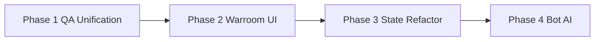

# Remediation & Refactor Execution Plan

**Source:** [docs/40_reports/convenes/20260309_PARADOX_TEAM_EVALUATION.md](../40_reports/convenes/20260309_PARADOX_TEAM_EVALUATION.md)  
**Rules:** [docs/20_engineering/PARADOX_RULES.md](../20_engineering/PARADOX_RULES.md)  
**Date:** 2026-03-09

---

## Scope
Execute the remediation steps identified during the Paradox Team Evaluation. The focus is on consolidating QA pipelines, closing UI placeholder gaps, reducing state/AI monoliths, and hardening schema validation.

---

## Phase 1 — QA Unification & Coverage (QA Engineer & Build Engineer)
**Goal:** Streamline the testing process and introduce measurable coverage metrics.

**Deliverables:**
- Configure `@vitest/coverage-v8` for UI tests and Node experimental test coverage for the engine.
- Create a unified `npm run qa:all` script in `package.json` that sequentially streams typechecks, fast node tests, vitest checks, desktop map builds, and baseline regressions.
- Expand the `manifest.json` for the scenario baseline runner to include a full 52-week war-phase scenario (e.g., `apr1992_definitive_52w.json`).
- Document the new QA pipeline in the testing README/guidelines.

**Gates:** `npm run qa:all` runs successfully end-to-end and outputs an initial coverage report.

---

## Phase 2 — Warroom UI Completion (UI/UX Developer)
**Goal:** Eliminate P0 Warroom placeholders to finalize the Phase E command narrative experience.

**Deliverables:**
- Implement the **Command Briefing Modal** ("what matters now") linked to the `command_briefing_folio` physical anchor.
- Implement the **Operational Situation Modal** linked to the `desk_map` physical anchor (routing to map + sector stress / logistics summary).
- Remove generic routing fallbacks (e.g., routing to Reports for Command Briefing).
- Update `WARROOM_MASTER.md` to reflect these modals as 'implemented'.

**Gates:** Typecheck, `npm run desktop:map:build`, vitest UI smoke tests pass.

---

## Phase 3 — Engine & State Refactoring (Technical Architect & Systems Programmer)
**Goal:** Reduce the monolithic surface area of `GameState` and harden schema validation.

**Deliverables:**
- Restructure `GameState` properties into nested logical domains (e.g., `military`, `political`, `displacement`) to improve context scoping for pipeline phases.
- Ensure `GAMESTATE_TOP_LEVEL_KEYS` and deterministic serialization (`serializeGameState.ts`) accurately reflect these nested domains without breaking existing save compatibility (implementing migrations in `deserializeState`).
- Remove remaining legacy AoR/SID fallback logic from the pipeline.

**Gates:** Strict deterministic scenario run (`sim:scenario:run`), ensuring save/load round-tripping remains byte-for-byte identical. All node tests pass.

---

## Phase 4 — Bot AI Modularization (Gameplay Programmer)
**Goal:** Break down the monolithic brigade evaluation loop to prevent priority collisions.

**Deliverables:**
- Refactor the ~1000-line evaluator in `bot_brigade_ai_osid.ts`.
- Extract distinct tactical behaviors (Hold, Fill Gaps, Attack, Reserve) into separate, purely functional evaluation modules.
- Maintain absolute determinism and observable bot behavior (no changes to scenario outcomes).

**Gates:** Scenario probe compare (`sim:scenario:probe`) yields identical operational results to the existing baseline.

---

## Process (every phase)
- **Ledger:** Before implementation, add a ledger entry describing the blast-radius. After verification, update the entry with evidence.
- **Commit:** One commit per phase. 
- **Napkin:** Update `.claude/napkin.md` with lessons learned.
- **Docs:** Update `context.md` and `CODE_CANON.md` as modules are refactored.
- **Process QA:** Invoke `quality-assurance-process` before handoff/merge.

---

## Execution Order

*Note: Phase 1 (QA) must come first so we have accurate coverage metrics and a unified test command to rely on for the heavier refactoring in Phases 3 and 4.*