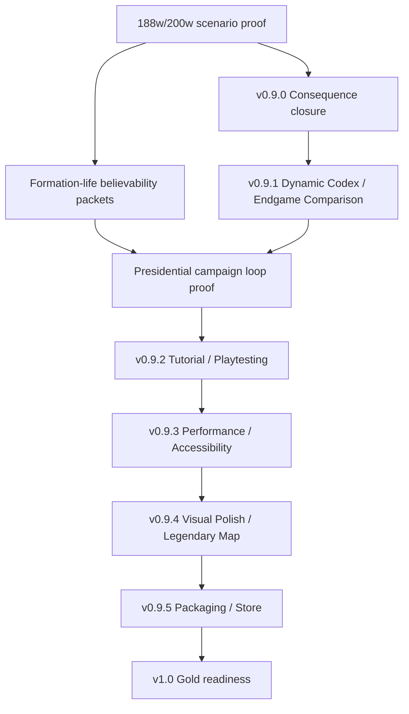

# Roadmap Plan Coverage And System Integration Audit

**Date:** 2026-04-30
**Status:** ARCHITECTURE AUDIT
**Scope:** `docs/plans/MASTER_ROADMAP.md`

## Executive Finding

The roadmap is mostly plan-covered through `v0.9.5`. The missing coverage was not feature names; it was integration ownership:

- The presidential campaign loop was implied across several plans but not owned as one player journey.
- Formation-life believability was visible in diagnostics and scorecards but not first-class in the roadmap.
- `v1.0` had only an old launch checklist, not a current integration gate.
- Post-1.0 updates were roadmaped but not execution-planned.
- Open design questions lacked a resolution process plan.

New plans created in this pass:

- `docs/plans/2026-04-30-v09-presidential-campaign-loop-closure-plan.md`
- `docs/plans/2026-04-30-v09-formation-life-believability-plan.md`
- `docs/plans/2026-04-30-v1-gold-readiness-integration-plan.md`
- `docs/plans/2026-04-30-post-1-0-content-execution-plan.md`
- `docs/plans/2026-04-30-roadmap-open-design-questions-resolution-plan.md`

## Coverage Matrix

| Roadmap Item | Plan Coverage | Verdict | Integration Notes |
|---|---|---|---|
| Studio Health / Repo Truth | `2026-04-06-studio-health-repo-truth-plan.md` | Covered | Must run after major scenario evidence and branch integrations. |
| v0.8 command chain through v0.8.4 | Historical milestone plans + implemented reports | Covered / closed | No new plan needed. |
| v0.8.x-final operations cleanup | `2026-03-31-v08x-operations-singularity-plan.md`, `2026-04-01-v08x-sector-anchored-corps-operations-plan.md` | Covered | Some follow-up lives in v0.9 UX/consequence work. |
| v0.8-to-v0.9 simplification | `2026-04-10-v08to09-a-plus-plus-system-scorecard-plan.md` and subplans | Covered / closed | Use scorecard as supporting evidence, not a new milestone. |
| v0.9 presidential loop | New `2026-04-30-v09-presidential-campaign-loop-closure-plan.md` | Newly covered | Cross-cuts Warroom, Army HQ, map, review, result, consequence, verdict. |
| v0.9 full-war proof | Master Roadmap gate + scenario protocol | Covered as gate | Claude scenario setup owns run execution; roadmap owns closure criteria. |
| v0.9 formation-life believability | New `2026-04-30-v09-formation-life-believability-plan.md` | Newly covered | Must not weaken diagnostics before owner behavior is understood. |
| v0.9.0 Consequence System | `2026-04-14-v090-consequence-system-refresh-plan.md`, older consequence plan, canon gate plans | Covered | Must feed v0.9.1, not run in parallel without stable flags/contracts. |
| Cost Ledger | `2026-03-26-cost-ledger-template-format.md`, canon gate | Partly covered | Needs authoring execution under v0.9.0; sensitive wording gate already exists. |
| v0.9.1 Dynamic Essay + Endgame Comparison | `2026-04-06-v091-dynamic-essay-endgame-comparison-plan.md` | Covered | Consumes consequence flags and historical comparison; should not precede v0.9.0 substrate closure. |
| v0.9.2 Playtesting + Balance | `2026-03-31-v092-tutorial-and-onboarding-plan.md`, old playtesting/balance plans | Covered | Must wait for presidential loop and v0.9.0/v0.9.1 closure. |
| v0.9.3 Performance + Accessibility | `2026-04-06-v093-performance-accessibility-plan.md` | Covered | Must happen before v0.9.4 feature-heavy visuals and v0.9.5 packaging. |
| v0.9.4 Visual Polish + Legendary Map | `2026-04-06-v094-visual-polish-legendary-map-features-plan.md` | Covered | Consumes performance budgets and player-safe read model. |
| v0.9.5 Platform Packaging + Store | `2026-04-06-v095-platform-packaging-store-plan.md` | Covered | Must consume v0.9.3 proof and avoid stale `dist-packaged/` artifacts. |
| v1.0 Gold | New `2026-04-30-v1-gold-readiness-integration-plan.md` | Newly covered | Old gold plan remains launch-day checklist only. |
| Post-1.0 updates | New `2026-04-30-post-1-0-content-execution-plan.md` | Newly covered | Current Master Roadmap supersedes old post-1.0 table. |
| Open design questions | New `2026-04-30-roadmap-open-design-questions-resolution-plan.md` | Newly covered | Prevents implementation from starting from unresolved policy/canon choices. |

## Cross-Plan Dependency Map

## Conflict / Collision Notes

1. **Old v1.0 post-launch table conflicts with Master Roadmap.**
   - `docs/plans/2026-03-16-v1.0.0-gold.md` lists old post-launch codenames.
   - Current Master Roadmap is authoritative.
   - New v1 integration plan marks the old file as supporting launch checklist only.

2. **v0.9.1 depends on v0.9.0 flags and consequence meaning.**
   - Dynamic essays and endgame comparison should not invent alternate consequence interpretation.
   - Consequence flags, verdict packet, and Cost Ledger contract must be stable first.

3. **v0.9.4 visual features depend on v0.9.3 performance/accessibility.**
   - Map That Scars, Refugee Column, and Corridor Heartbeat add rendering load.
   - They need performance budgets and accessible alternatives before final polish.

4. **Formation-life fixes can affect calibration.**
   - Drift and HRHB/HVO emergence are simulation behavior, not cosmetic diagnostics.
   - Every fix needs fresh scenario proof and PROJECT_LEDGER entry.

5. **Playtesting before loop closure would generate noisy feedback.**
   - v0.9.2 should not begin until the player can understand a full presidential loop.

## Recommended Execution Order

1. Claude completes current scenario setup and 188w/200w proof.
2. Run Studio Health roadmap sync.
3. Execute v0.9 formation-life classification and first packet.
4. Execute v0.9 consequence closure.
5. Execute v0.9.1 endgame/dynamic Codex closure.
6. Run presidential campaign loop walkthrough.
7. Open v0.9.2 playtesting/onboarding.

## Done Means For This Audit

- Every roadmap item has a plan, supporting plan, or child-plan trigger.
- Every cross-plan dependency is named.
- The roadmap no longer relies on implicit architecture glue.
