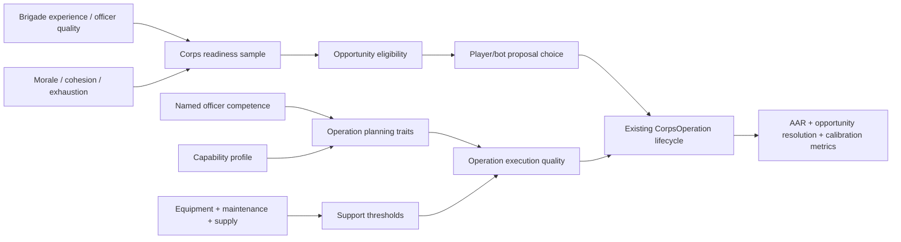

# Force Quality To Operations Architecture Contract

**Date:** 2026-05-01
**Status:** Architecture contract / implementation-shaping doc
**Owner lane:** Codex architect lane, parallel to Claude's Force Quality Trajectory Evidence Audit
**Related docs:**
- `docs/plans/2026-05-01-force-quality-trajectory-calibration-issue.md`
- `docs/research/2026-05-01-force-quality-trajectory-research-and-proposals.md`
- `docs/plans/late-war-operation-opportunity-system-design.md`
- `docs/plans/2026-05-01-operation-opportunity-review-surface-design.md`
- `docs/40_reports/CALIBRATION_MASTER.md`

## Purpose

This contract defines how the game's force-quality arc is allowed to affect late-war operations.

It exists so the next implementation packets do not "fix" the 1995 map by adding hidden combat bonuses, date-forced captures, or scripted historical operations. The desired behavior is that the player/bot sees credible operational opportunities because the force has or has not developed the institutional capacity to exploit them.

Claude's parallel audit owns evidence: which current systems are wired, decorative, or mis-scaled. This doc owns the target architecture: where those systems should connect once the evidence comes back.

## Design Principle

Force quality is not one number.

It is a stack of institutional traits:

| Trait | ARBiH 1992 | ARBiH 1995 | VRS 1992 | VRS 1995 |
|---|---|---|---|---|
| Brigade combat learning | uneven, local | experienced core brigades | high inherited baseline | attrited and uneven |
| Named officer competence | thin bench | field-proven commanders | professional JNA cadre | casualties, removals, strain |
| Corps organization | fragmented | corps/division/OG capable | mature staff system | politically stressed, brittle |
| Heavy support | scarce | limited but useful thresholds | abundant inheritance | worn, fuel/spares constrained |
| Operation delivery | mostly defensive/local | staged multi-brigade pressure | strong early offensives | local defense/counterattack, weak sustained initiative |

The architecture must convert those traits into **operation readiness and execution quality**, not generic combat inflation.

## Forbidden Shapes

These are architectural anti-patterns for this lane:

- **No calendar victory rails.** A historical date window may surface an opportunity; it must not force the outcome.
- **No raw 1995 ARBiH combat multiplier.** Professionalization should improve staging, coordination, support, and capture delivery, not make every attack stronger everywhere.
- **No total VRS collapse switch.** VRS decline should weaken sustained initiative and recovery while preserving local defensive and counterattack danger.
- **No painted-target feedback loop.** Painted targets evaluate divergence; they must not drive eligibility or control flips.
- **No sensitive-history bypass.** Safe-area territorial operations remain military opportunities; atrocity/rupture consequences stay in locked consequence systems.

## Signal Ownership

The force-quality stack should be composed from existing state owners where possible.

| Signal | Current owner | Architectural role | Expected consumer |
|---|---|---|---|
| `formation.officer_quality` | `officer_quality_update.ts` | brigade-level command learning | local attack/defense quality, readiness sampling |
| named-officer competence | `officer_experience.ts`, officer system | commander ability | operation planning, staging, recovery |
| `faction_officer_maturity` | `officer_experience.ts` | faction command bench maturity | high-level operation readiness, multi-axis limits |
| `capability_profile` | `capability_progression.ts` | time-indexed institutional arc | operation eligibility/coordination, not raw combat |
| cohesion floor/ceiling | `faction_progression.ts`, timeline | organizational staying power | readiness, fatigue recovery, sustained effort |
| morale drift | `morale_drift.ts` | will to continue under success/failure | launch confidence, failure recovery, collapse risk |
| equipment state/decay | `faction_progression.ts`, combat equipment modules | support threshold and maintenance | artillery/armor support readiness |
| war exhaustion | existing faction/corps state | strategic fatigue | operation cadence, reserve response, abort likelihood |
| opportunity prerequisites | opportunity system design | historical windows and decision surface | proposal queue / bot choice / player review |

If Claude's audit proves any of these are decorative or mis-scaled, the implementation packet should connect or repair the signal at this table's intended consumer, not invent a parallel substitute.

## Flow

The intended data flow is:

The important boundary is that `CorpsOperation` remains the execution owner. Force-quality systems should feed **whether an operation is plausible** and **how cleanly it stages/coordinates/recovers**, not create a second combat engine.

## Operational Traits

Implementation packets should aim for explicit traits rather than invisible multipliers.

| Trait | Meaning | Likely inputs | Likely effects |
|---|---|---|---|
| `operation_readiness` | Can this corps launch at all? | cohesion, morale, equipment condition, officer quality, exhaustion | proposal eligibility, commander recommendation |
| `staging_reliability` | Can brigades reach the start line in time? | capability profile, commander competence, supply, distance | planning duration, movement-only failure risk |
| `axis_coordination` | Can multiple axes act together? | faction maturity, named officer competence, corps maturity | max axes, sync penalty, simultaneous attack chance |
| `support_delivery` | Is artillery/armor support meaningful? | equipment totals, ammo/supply, maintenance condition | suppression/support availability, not generic bonus |
| `failure_recovery` | Can the corps regroup after repulse? | morale, officer competence, cohesion, exhaustion | abort thresholds, consecutive failure tolerance |
| `reserve_response` | Can army/corps reserves arrive when needed? | command coherence, logistics, exhaustion | defensive counteraction and exploitation response |
| `collapse_susceptibility` | Does a line unravel under pressure? | morale, recent loss, displacement/evacuation, officer loss | local retreat/disorder risk after defeats |

These traits should be persisted or reported enough to debug. A hidden formula that changes outcomes without a trace is not acceptable for this lane.

## Faction Shape

### ARBiH

ARBiH professionalization should primarily unlock:

- larger credible operation rosters,
- better staging completion,
- better multi-axis synchronization,
- better failure recovery,
- support thresholds when artillery/captured armor exists,
- corps-level pressure in 1994-1995 where geography and logistics permit.

It should not automatically erase the equipment gap. If a run starves ARBiH of supply, officers, or intact corps, the opportunity model should reflect that and the late-war offensive arc should be weaker.

### VRS

VRS degradation should primarily reduce:

- broad offensive cadence,
- multi-front coordination,
- reserve redeployment reliability,
- recovery after repeated failures,
- replacement officer quality,
- ability to exploit heavy weapons over long campaigns.

It should preserve:

- prepared defense,
- artillery danger where equipment remains functional,
- local counterattack ability by intact quality formations,
- better-than-history counterfactual survival if logistics, officers, and morale are preserved.

### HRHB / Federation Context

HRHB/HV/Federation cooperation should be represented as staging/logistics/alliance context, especially after Washington Agreement. It should not become a silent HRHB universal strength bonus. The useful shape is corridor access, support availability, and joint-op eligibility.

## Player-Facing Consequences

The player should experience force quality through staff language and operation proposals:

- "5th Corps can now stage a two-axis operation, but armor support is thin."
- "VRS 2nd Krajina remains dangerous in prepared positions, but reserve response is brittle."
- "This opportunity is eligible because enemy morale and support are degraded; delaying may miss the window."
- "The corps can approve the operation, but under-resourcing will likely produce a failed launch or partial success."

That means the eventual implementation needs a reporting path, not just a simulation path. At minimum, operation diagnostics and AAR should expose the traits above in compact form.

The player-facing owner for those traits is the Army HQ opportunity dossier defined in `docs/plans/2026-05-01-operation-opportunity-review-surface-design.md`. The traits should appear as player-safe bands and staff reasons, not raw hidden formulas.

## Implementation Packet Rules

Future packets should follow this sequence unless Claude's audit proves a different single-owner blocker:

1. **Unit semantics first.** If `officer_config.learning_rate` is mis-scaled, fix that before wiring more consumers.
2. **Consumers before tuning.** If `capability_profile` or `faction_officer_maturity` is decorative, wire it into readiness/coordination before changing numeric values.
3. **One trait per packet.** Do not add all traits at once. Start with `operation_readiness` or `staging_reliability`, then run date-window evidence.
4. **Metrics before acceptance.** Every behavior packet must compare 40w, 104w, 156w, and 183/188w on operation attempts, captures, and force-quality distributions.
5. **No regional patching.** If a packet only fixes one named operation by special case, it belongs in an opportunity-family doc, not this architecture lane.

## Minimum Viable Slice

The smallest useful implementation slice after the audit is:

1. Confirm/fix officer learning semantics.
2. Add a deterministic `computeCorpsOperationReadiness(...)` helper that reads existing state and emits a traceable trait object.
3. Consume that helper in opportunity eligibility or army/corps operation proposal scoring.
4. Emit the trait in diagnostics/AAR for review.
5. Run 40w/104w/156w/183w evidence.

That slice is valuable even if it does not solve all late-war movement, because it creates the contract through which later maturity/equipment/degradation traits can flow.

## Review Checklist

Codex should reject a future packet if:

- it changes territory without explaining the force-quality trait that changed,
- it changes combat power globally without a readiness/coordination owner,
- it hardcodes a historical operation outcome,
- it makes VRS unable to defend locally in 1995,
- it makes ARBiH universally strong regardless of supply/officers/equipment,
- it leaves no diagnostic evidence for the trait it adds,
- it updates calibration targets to hide a force-quality failure,
- it touches sensitive-history consequences without the gate required by `SENSITIVE_HISTORY_DESIGN_GATE.md`.

## TL;DR

Force quality should be a **readiness and execution layer** between historical opportunity and the existing `CorpsOperation` lifecycle. ARBiH improves by staging, coordinating, supporting, and recovering better. VRS degrades by losing sustained coherence, reserve response, and recovery while staying dangerous locally. The next implementation work should repair/wire existing signals, one trait at a time, with date-window evidence.
